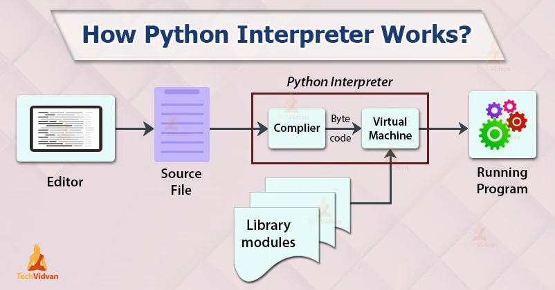
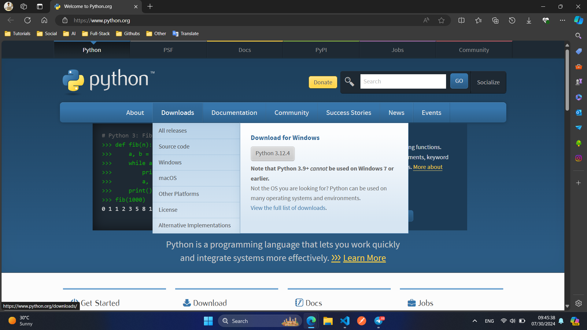
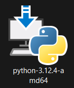
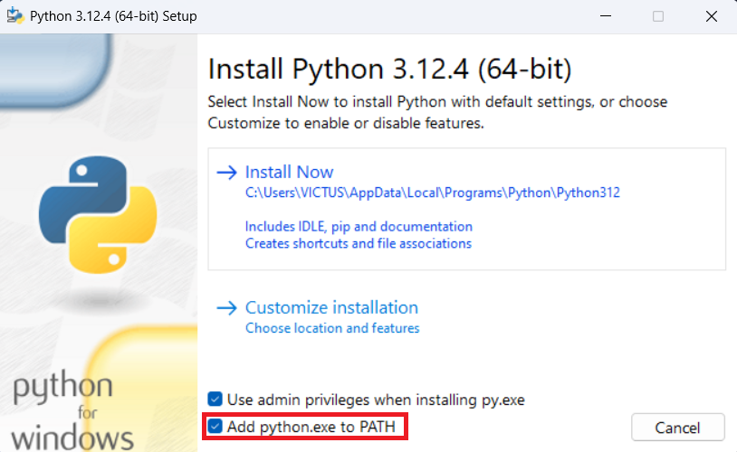
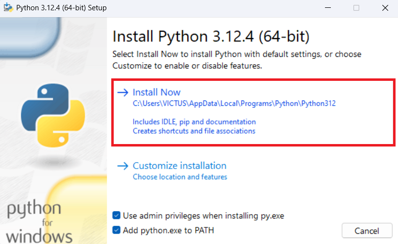

# Python Programming language

> [!NOTE]
> 1980-yillarning oxirida **Guido van Rossum** Python dasturlash tilini yaratishni orzu qilgan edi. Pythonning **birinchi versiyasi – 0.9.0, 1991-yilda chiqarilgan.** Chiqarilgandan so‘ng, Python ommalasha boshladi. Hisobotlarga ko‘ra, hozirda Python texnologiyalar sohasida yuqori talabga ega bo‘lgani sababli dasturchilar orasida eng mashhur dasturlash tili hisoblanadi.


## What is Python?

>[!NOTE] 
> Python – bu **general-purpose(umumiy maqsadli)**, **dynamically typed(dinamik turdagi)**, **high-level(yuqori darajadagi)**, **compiled and interpreted**, **garbage-collected**, **object-oriented programming language**, **functional programming**ni qo‘llab-quvvatlaydi.

### Features of Python:
- **Easy to use and Read(Foydalanish va o‘qish uchun qulay)** Pythonning sintaksisi boshqa dasturlash tillariga qaraganda **osonroq** va **tushunarliroq**, shuning uchun yangi boshlovchilar uchun juda qulay va xatoliklar yuzaga kelish ehtimolini kamaytiradi.
- **Dynamically Typed:** Dinamik turdagi dasturlash tilida o'zgaruvchilarning ma'lumot turi ishlatilish vaqtida aniqlanadi. Bu degani, o'zgaruvchiga qanday ma'lumot turi berilganligini dastur ishlab boradigan paytda bilib olish mumkin. Bu tillarda o'zgaruvchiga turli xil ma'lumot turlarini berish mumkin.
  - **Advantages of Dynamically Typed Languages:**
    - **Faster development:** Dastur tezlashadi, chunki o'zgaruvchilarning turlarini aniqlashga vaqt sarflanmaydi.
    - **Concise code:** Kamroq kod yoziladi, chunki o'zgaruvchilarning qiymatini aniqlash uchun qo'shimcha kod yozilmaydi.
    - **Easier code modification:** Dasturni o'zgartirish oson bo'ladi, chunki o'zgaruvchilarning turlarini o'zgartirish uchun kamroq ish talab qilinadi.
  - **Disadvantages of Dynamically Typed Languages:**
    - **Increased potential for runtime errors:** Type-related errors may not be detected until runtime.
    - **Reduced code readability:** Dasturlarni tushunish qiyinroq bo'lishi mumkin, chunki o'zgaruvchilarning turlarini dastur ishlab boradigan paytda bilish mumkin.
    - **Challenges in code optimization:** Dasturlarni optimizatsiya qilish qiyinroq bo'lishi mumkin, chunki o'zgaruvchilarning turlarini aniqlash uchun qo'shimcha vaqt va resurslar talab etiladi.
  - **Examples of Dynamically Typed Languages:**
    - Python
    - JavaScript
    - Ruby
    - PHP

- **Interpreted Language:** Python interpretator tili hisoblanadi, ya'ni kod `qatorma-qator` bajariladi. Bu xatoliklarni tezda topishga yordam beradi va dasturlashni qulaylashtiradi.

- **Cross-Platform:** Python ko‘pgina operatsion tizimlarda ishlaydi, masalan, `Windows`, `MacOS`, va `Linux`.

- **Extensive Library Collections:** Python o'zining boy standart kutubxonasi va modullari bilan ko'plab vazifalarni bajarishga imkon beradi, shu jumladan, `development`, `data analysis`, `machine learning` va boshqalar.

- **Object-Oriented Programming:** Python `OOP`ni qo'llab-quvvatlaydi. Bu katta dasturlarni modullarga ajratib, ularni mustaqil ravishda ishlashini osonlashtiradi.

- **Flexible and Extensible:** Pythonni boshqa tillar bilan birlashtirish yoki maxsus kutubxonalar orqali kengaytirish mumkin.


### Python qanday ishlaydi?

- **Code Writing**: Dastlab Python kodini `.py` fayl ko'rinishida yozasiz.
- **Interpreter Runs**: Python interpretatori ushbu kodni o’qib, uni mashina tushunadigan `baytlarga` o‘zgartiradi. Bu jarayonda kod `qatorma-qator` tahlil qilinadi va ishlatiladi.
- **Conversion to Bytecode**: Kod `bytecode`ga o‘zgartiriladi, bu esa Python `PVM`da ishlaydi. `bytecode` — bu kompyuterga tushunarli bo’lgan oraliq kod, lekin u hali ham yuqori darajali tildir.
- **Python Virtual Machine (PVM)**: `bytecode` PVM orqali ishlaydi, va bu virtual mashina dastur kodini to‘liq bajaradi. Bu jarayon kompyuteringiz operatsion tizimi orqali amalga oshiriladi.
- **Output Generated**: Kod bajarilishi bilan natijalar ekranga chiqariladi yoki kerakli hisob-kitoblar amalga oshiriladi.



### Pythonning qo‘llanish sohalari:

- **Web Development:** [Django](https://www.djangoproject.com/), [Flask](https://flask.palletsprojects.com/en/3.0.x/) kabi freymvorklar orqali veb-saytlar va veb-ilovalar yaratish.
- **Data Analysis and Scientific Computing:** [NumPy](https://numpy.org/), [pandas](https://pandas.pydata.org/), [SciPy](https://scipy.org/), [matplotlib](https://matplotlib.org/) kabi kutubxonalar yordamida.
- **AI(Artificial Intelligence) and Machine Learning:** [TensorFlow](https://www.tensorflow.org/), [Keras](https://keras.io/), [PyTorch](https://pytorch.org/) kabi kutubxonalar yordamida.
- **Automation and Scripting:** Turli xil vazifalarni avtomatlashtirish uchun.
- **Game Development:** [Pygame](https://www.pygame.org/news) kabi kutubxonalar yordamida.


### Python Muhiti va O‘rnatish:
>[!NOTE]
> Python dasturlash tilida dasturlashni boshlash uchun sizga Python interpretatorini kompyuteringizga o‘rnatish kerak bo‘ladi. Pythonning rasmiy veb-saytida Pythonning oxirgi versiyasini yuklab olish mumkin. Shuningdek, muhitni boshqarish va kod yozish uchun turli vositalar va muharrirlar mavjud.

#### Python O‘rnatilishi:
Windows
1. Pythonni yuklab olish:
    - [Pythonni rasmiy web-saytiga](https://www.python.org/) kiring.
    - `Downloads` bo‘limiga o‘ting va `Windows` uchun oxirgi barqaror versiyasini yuklab oling.

    

2. Pythonni o‘rnatish:
    - Yuklab olingan `.exe` faylini ishga tushiring.

    

    - `Add Python to PATH` katagiga belgi qo‘ying. Bu belgi Python'ni kompyuteringizdagi barcha joylarda ishlatishga imkon beradi.

    

    - `Install Now` tugmasini bosing va o‘rnatishni yakunlang.

    

    - Indikator to'lishini kutamiz.

    

    - `Setup was successfull` muvaffaqiyatli o'rnatildi.

    

3. O‘rnatishni tekshirish:
    - `Command Prompt` yoki `PowerShell`ni oching.
    - `python --version` yoki `python -V` buyrug‘ini kiriting. Bu sizga o‘rnatilgan Python versiyasini ko‘rsatadi.

    

### `Hello, World!` dasturini yozish.
```python
print("Hello World!")
```

## AMALIYOT
- `Python` interpreterini o'rnatish.
- `Hello, World!` dasturini yozish va ishga tushirish.
- `print()` funksiyasi yordamida turli xabarlarni chiqarish.