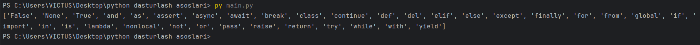

# Declaring Variables

> [!NOTE]
> Python `static type` dasturlash tillaridan farqli o‘laroq, o‘zgaruvchilarni e’lon qilishda `type`ni kiritishni talab qilmaydi. Python `dynamic type` dasturlash tili bo‘lgani uchun qiymatga qarab o‘zi o‘zgaruvchi turini aniqlaydi.


**O'zgaruvchi** — bu ma’lumotlarni vaqtincha saqlash uchun ishlatiladigan nomlangan konteynerlardir. O‘zgaruvchilar yordamida ma’lumotlar bilan ishlash, ularni saqlash va qayta ishlatish qulaylashadi.


### Basic Variable Declaration

Quyidagi misolda 4 ta o'zgaruvchi yaratdik (`x`, `y`, `name` va `is_active`) va ularga har xil ma'lumot yukladik.

```python
x = 5 # Butun son (int)
y = 3.14 # Haqiqiy son (float)
name = "Alice"  # Matn (str)
is_active = True  # Mantiqiy qiymat (bool)
print(x)
print(y)
print(name)
print(is_active)
```
> [!NOTE]
> `variable` diyilishini sababi uning qiymati istalgan payt o'zgarishi mumkin:

```python
name = 'Alisher'
print(name)
name = "Muhammad"
print(name)
```

Yuqoridagi misolda `name` nomli o'zgaruvchiga avval `Alisher` keyin esa `Muhammad` deb qiymat berdik.

# Rules for Naming Variables
> [!CAUTION]
> O'zgaruvchilarga nom berishda quyidagi qoidalarga amal qiling:
> - O'zgaruvchi nomi harf yoki pastki chiziq (`_`) bilan boshlanishi kerak
> - O'zgaruvchi nomi raqam bilan boshlanishi mumkin emas
> - O'zgaruvchi nomida faqatgina lotin alifbosi harflari (`A-z`), raqamlar (`0-9`) va pastki chiziq (`_`) qatnashishi mumkin
> - O'zgaruvchi nomida bo'shliq (пробел) bo'lishi mumkin emas
> - O'zgaruvchi nomida katta-kichik harflar turlicha talqin qilinadi (`ism`, `ISM`, va `Ism` uchta turli o'zgaruvchi)

**Q'shimcha qoidalar:**
- O'zgaruvchi nomini kichik harflar bilan yozing.
- O'zgaruvchi nomida 2 va undan ortiq so'z qatnashsa ularning orasini pastki chiziq (`_`) bilan ajrating (`ism_sharif="Umid G'aybullayev"`) 
- O'zgaruvchiga tushunarli nom bering (`y=20` emas `yosh=20`, `d="Korea"` emas `davlat = "Korea"` va hokazo)
- Shuningdek o'zgaruvchilarga Pythonda ishlatiladigan funksiyalar va maxsus kalit so'zlarning(keywords) nomini bermang. Kalit so'zlar ro'yhatini ko'rish uchun python faylga  uyidagi kodni yozamiz:
```python
import keyword
print(keyword.kwlist)
```
Marhamat, ekraningizda Pythondagi maxsus kalit so'zlar ro'yhatini ko'ryapsiz:

