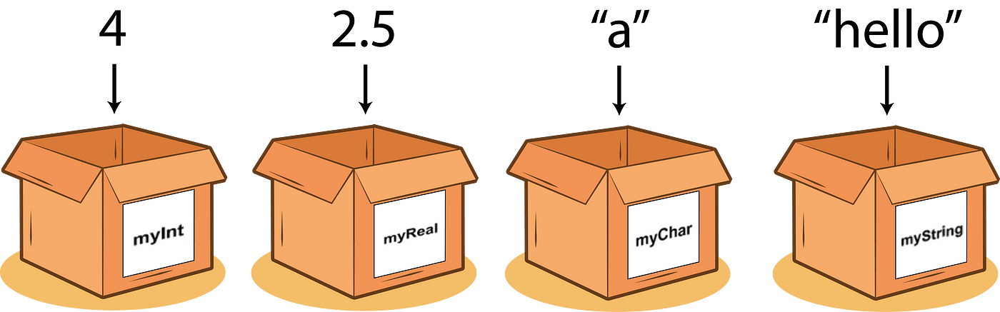

# Variables

**O'zgaruvchi** — bu ma’lumotlarni vaqtincha saqlash uchun ishlatiladigan nomlangan konteynerlardir. O‘zgaruvchilar yordamida ma’lumotlar bilan ishlash, ularni saqlash va qayta ishlatish qulaylashadi.



# Creating Variables

Python dasturlash tilida o'zgaruvchi yaratadigan keyword yo'q

O'zgaruvchi unga birinchi marta qiymat berilganda yaratiladi

```python
x = 5 # int -> Integer
y = 3.14 # float -> Floating point number
name = "Alice"  # str -> String
is_active = True  # bool -> Boolean
print(x)
print(y)
print(name)
print(is_active)
```

`variable` diyilishini sababi uning qiymati istalgan payt o'zgarishi mumkin.

```python
x = 5
x = "Hello world"
print(x)
```

# Casting

